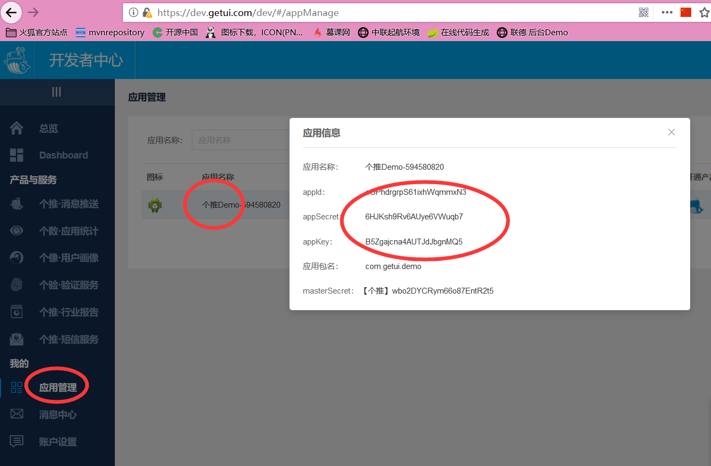

message-push 
================================
#### 消息推送 工具封装，目前支持第三方推送平台有：

- [个推](#个推)

## 个推

    个推 官网：https://dev.getui.com/
    个推 为开发者提供了如下4种消息推送形式：
    
    1) toSingle ：简称“单推”，指向单个用户推送消息
    2) toList：简称“批量推”，指向制定的一批用户推送消息
    3) toApp：简称“群推”，指向APP符合筛选条件的所有用户推送消息，支持定速推送、定时推送，支持条件的交并补功能
    4) toGroup：此方式为直播间定制方案，适用于直播间消息推送

###
- 第一步在 application.yml 中配置 个推应用信息
```yaml
# 个推平台 应用配置
getui:
  appId: oGPhdrgrpS61ixhWqmmxN3
  appKey: B5Zgajcna4AUTJdJbgnMQ5
  masterSecret: wbo2DYCRym66o87EntR2t5
```
提示：本示例中的配置信息，匹配的测试包APK 放在doc文件夹下的 getui_sdk.apk，可以直接拿来测试。<br>
也可以用自己在 个推 平台创建的应用<br>


- 个推 代码路径：com.andy.messagepush.getui 包下面
- 单推 toSingle：封装方法是 GetUIPushToSingle.java 类，对应的测试类是 ToSinglePushTest.java
- 批量推 toList：封装方法是 GetUIPushList.java 类，对应的测试类是 ToListPushTest.java
## Andy.wang


